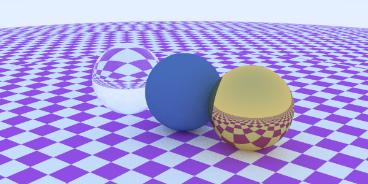
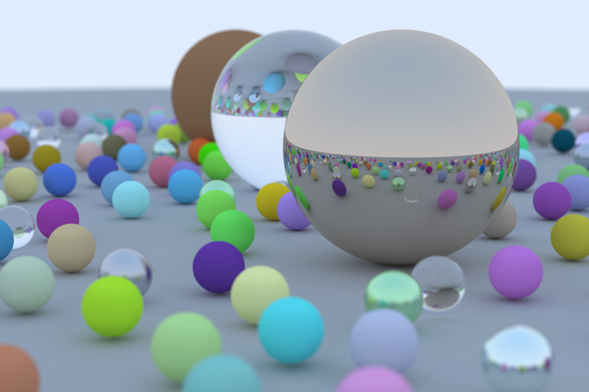
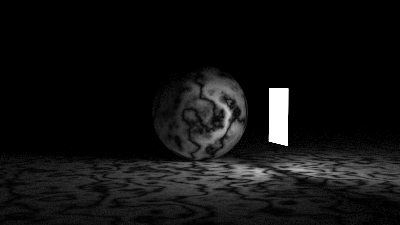
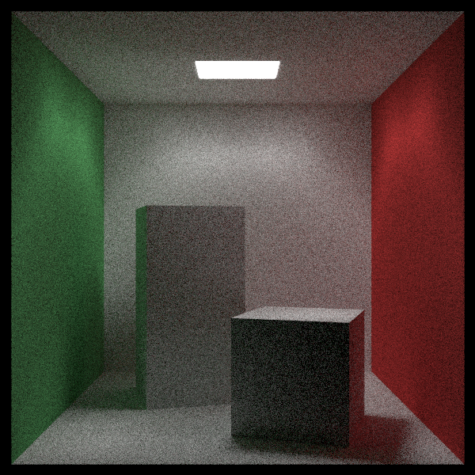

<h1 align="center">
    crab-rt
</h1>

> A toy raytracer written in Rust following
[The Ray Tracing in One Weekend series of books](https://raytracing.github.io/).

## To do
- Finish implementing *Ray Tracing The Next Week*
- SIMD

## Images

    
    
    
    

